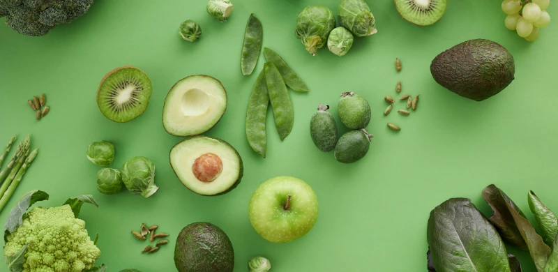

  

    

      
    

    

      <h1 class="text-5xl font-bold text-primary mb-4">Judithya Dwimanda</h1>
      <h2 class="text-3xl text-secondary mb-6">SEO Specialist</h2>
      
An SEO specialist believes it's essential to conduct thorough analysis and stay informed about the latest search engine algorithm updates. Also focus on creating content that follows SEO best practices while being engaging and easy for humans to read.

      

        <a href="https://facebook.com/j2manda" target="_blank" rel="me" class="social-icon text-primary hover:text-secondary">
          <i class="fab fa-facebook fa-2x"></i>
        </a>
        <a href="https://instagram.com/judith_dwm" target="_blank" rel="me" class="social-icon text-primary hover:text-secondary">
          <i class="fab fa-instagram fa-2x"></i>
        </a>
        <a href="https://bsky.app/profile/bluesky.judymad.com" target="_blank" rel="me" class="social-icon text-primary hover:text-secondary">
          <i class="fa-brands fa-bluesky fa-2x"></i>
        </a>
        <a href="https://www.linkedin.com/in/judithya-dwimanda/" target="_blank" rel="me" class="social-icon text-primary hover:text-secondary">
          <i class="fab fa-linkedin fa-2x"></i>
        </a>
      

    

  

  

    
  

  

    <h2 class="text-3xl font-bold text-white text-center mb-12">Know-How</h2>
    

      

        

          <i class="fas fa-search"></i>
        

        <h3 class="text-xl font-bold text-white mb-2">Keyword Research</h3>
        
Analyze and identify high-potential keywords to boost your website traffic and improve its visibility online.

      

      

        

          <i class="fas fa-code"></i>
        

        <h3 class="text-xl font-bold text-white mb-2">Technical SEO</h3>
        
Optimize your website's technical aspects to enhance performance and improve crawlability for search engines.

      

      

        

          <i class="fas fa-chart-line"></i>
        

        <h3 class="text-xl font-bold text-white mb-2">Analytics & Reporting</h3>
        
Analyze data and create comprehensive SEO performance reports to drive actionable insights and improvements.

      

    

  

  

    <h2 class="text-3xl font-bold text-white mb-8">Let's Collaborate</h2>
    
Interested in working together? Let's discuss your project and bring your vision to life.

    <a href="mailto:judith.dwm@gmail.com" class="inline-block bg-white text-accent2 px-8 py-3 rounded-md font-medium hover:bg-light transition-colors material-shadow relative hover:before:content-['\40'] hover:before:font-awesome hover:before:mr-2 before:opacity-0 hover:before:opacity-100 before:translate-x-[-10px] hover:before:translate-x-0 before:transition-all before:duration-300">Mail Me</a>
  

